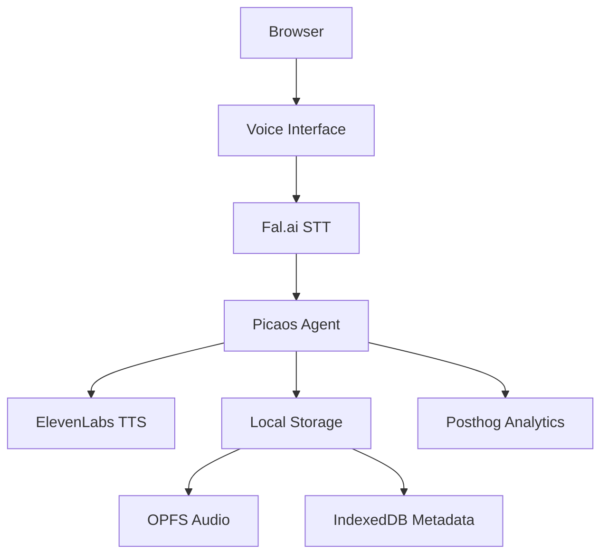

# DuckTheDay Dev Notes

> **NOTE**: This document is AUTO-AI generated and constantly evolving. Contents may be incomplete or contain inconsistencies - verify critical details, don't believe anything you read here😅.

## Project Overview
**Problem**: Passive content consumption & poor knowledge retention, habit tracking and goal logging is tedious 
**Solution**: Voice-first agentic companion that actively engages users  
**Key Features**:
- Tamagotchi-style duck persona
- Socratic questioning via voice
- Local-first knowledge storage
- Sponsor tech integration (ElevenLabs, Fal.ai, Picaos)

## Architecture


## Tech Stack
**Core**:
- Frontend: FastHTML + HTMX
- Backend: Python (Starlette)
- Voice: ElevenLabs + Fal.ai
- Agents: Picaos

**Storage**:
- Audio: Origin Private File System (OPFS)
- Metadata: IndexedDB
- Analytics: Posthog

## Setup
### Prerequisites
```bash
# Install requirements
pip install python-fasthtml python-dotenv
```

### Environment Variables (`.env`)
```env
ELEVENLABS_KEY="your_key"
FAL_AI_KEY="your_key" 
PICAOS_KEY="your_key"
```

## Code Structure
```plaintext
/src
├── main.py           # FastHTML server
├── agents/          # Picaos workflows
├── voice/           # STT/TTS handlers
├── static/          # Duck assets
└── storage/         # Local storage utils
```

## Core Implementation
### Voice Processing Pipeline
```python
# app.py
from fasthtml import *

@rt("/process")
async def voice_handler(request):
    audio = await request.media()
    text = fal_stt(audio)
    response = picaos_agent(text)
    return Audio(elevenlabs_tts(response))
```

### Agentic Workflow
```python
# agents/knowledge.py
def process_text(text: str) -> dict:
    """Picaos-powered knowledge processing"""
    return {
        "summary": picaos.run("summarize", text),
        "questions": picaos.run("generate_quiz", text),
        "next_review": calculate_spaced_repetition()
    }
```

### Local Storage
```javascript
// static/js/storage.js
const storeAudio = async (blob) => {
  const root = await navigator.storage.getDirectory();
  const file = await root.getFileHandle(`audio_${Date.now()}.webm`, {create: true});
  const writer = await file.createWritable();
  await writer.write(blob);
  await writer.close();
};
```

## Roadmap

```mermaid
gantt
    title Hackathon Timeline
    dateFormat  HH:mm
    section Phase 1
    Voice Pipeline :a1, 00:00, 8h
    section Phase 2
    Agent Logic :a2, 08:00, 12h
    section Phase 3
    Storage & UI :a3, 20:00, 8h
```


## Sponsor Integration
### ElevenLabs
```python
def elevenlabs_tts(text: str, voice: str = "duck") -> bytes:
    response = httpx.post(
        "https://api.elevenlabs.io/v1/text-to-speech/EXAVITQu4vr4xnSDxMaL",
        json={"text": text},
        headers={"xi-api-key": os.getenv("ELEVENLABS_KEY")}
    )
    return response.content
```

### Fal.ai
```python
async def fal_stt(audio: bytes) -> str:
    async with httpx.AsyncClient() as client:
        response = await client.post(
            "https://fal.ai/whisper",
            files={"file": audio},
            headers={"Authorization": f"Key {FAL_AI_KEY}"}
        )
    return response.json()["text"]
```

## Error Handling
**Common Issues**:
- Audio Timeout: Fallback to "Quack? I didn't hear that!"
- API Limits: Cache responses locally
- Storage Full: Rotate oldest files

## Testing
```bash
# Run test suite
python -m pytest tests/ -v

# Monitor Posthog
open https://us.posthog.com/dashboard
```

## Pitch Preparation
**Demo Flow**:
1. Show empty knowledge base
2. Voice input: "I learned about neural networks today"
3. Demonstrate auto-generated quiz
4. Show local storage inspection
5. Play "duck evolution" after 3 correct answers

**Key Slides**:
- Architecture Diagram
- Sponsor Tech Usage
- Before/After Knowledge Retention Metrics